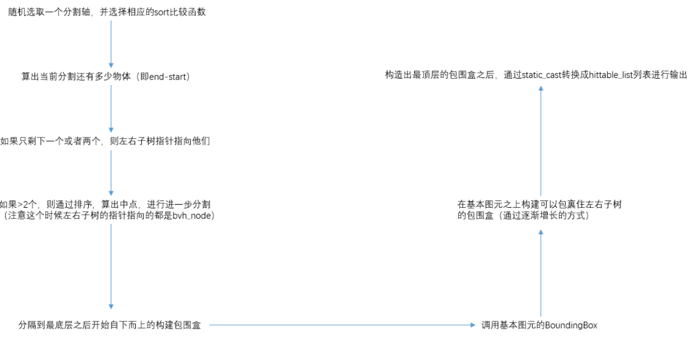
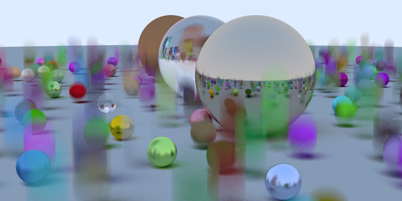
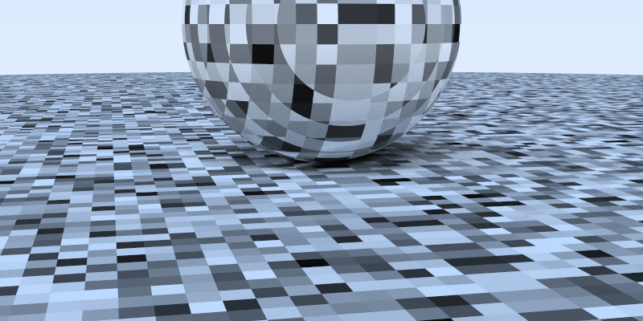
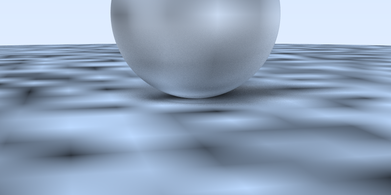
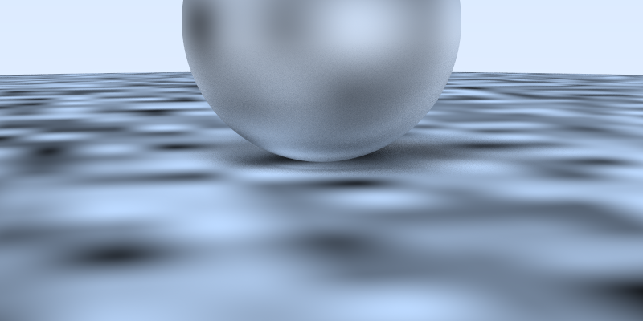
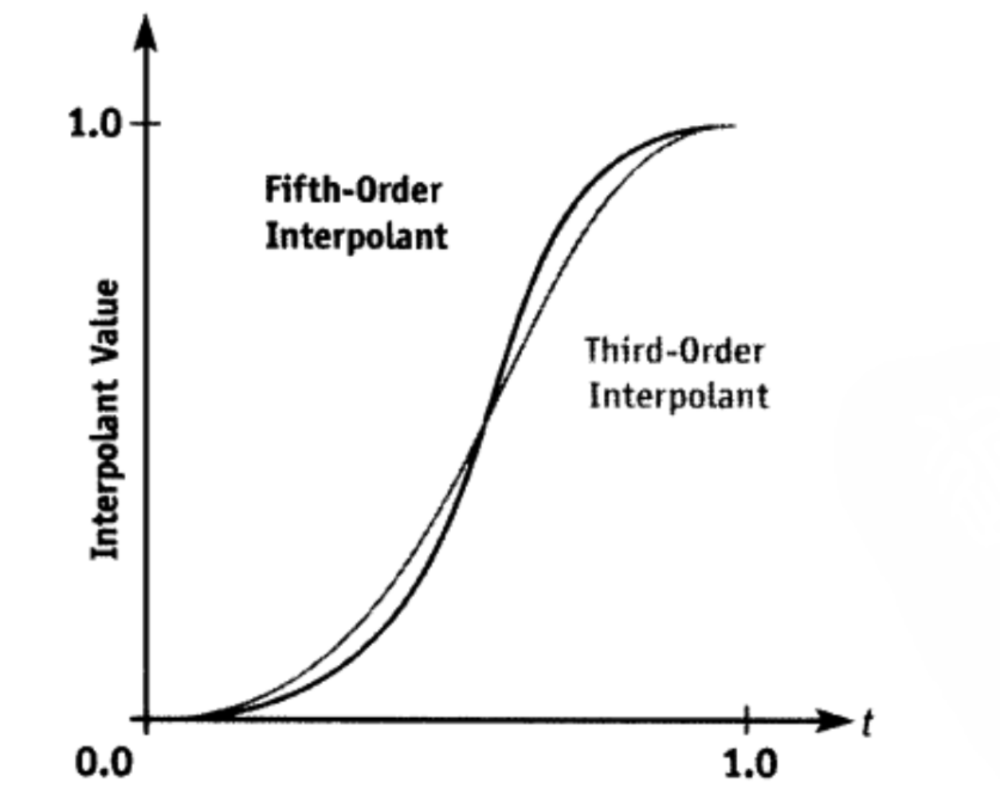
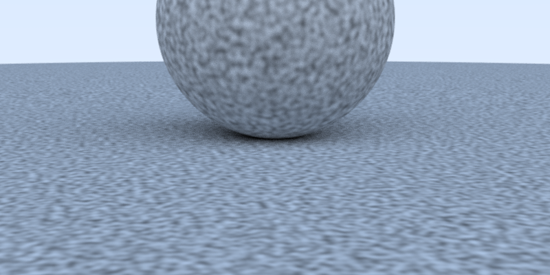
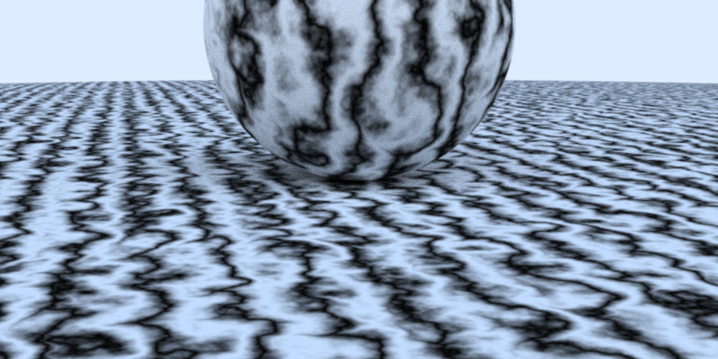

# RayTracing-The-next-week

使用vs2022+opencv实现RayTracing The next week的内容，使用opencv将ppm图片实时渲染。

一个ppm文件查看网站：https://www.cs.rhodes.edu/welshc/COMP141_F16/ppmReader.html

## BVH树：

使用bvh后速度大大提升

同一张动态模糊的图，没有bvh用了70分钟，用bvh只需13分钟！

## 柏林噪声

跟着跑代码很容易，但是要理解比较难

### 通过哈希映射得到随机值

### 三线性插值

### 使用Hermit Cubic进行插值

作者使用的三次曲线，还有五次曲线，实际上就是几阶导数等于0

### 梯度向量和距离向量点乘

我的理解是：三线性插值得到的结果还在正方体中，用梯度向量后得到的结果却可以跳出正方体，也就是说，可以取得的颜色更广，自然也就没有方块感

### 扰动(turbulence)

使用多个频率相加得到复合噪声

对于不同参数得到其他效果，可以深入学习分形布朗运动（‌FBM）‌
